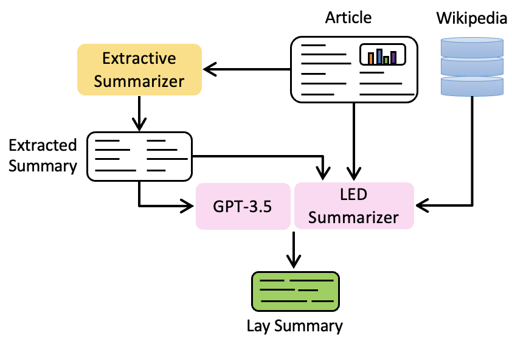

[](https://biolaysumm.org/2024/)
[](https://aclanthology.org/2024.bionlp-1.11/)


## UIUC_BioNLP@BioLaySumm2024
The official repository of the Paper: 
[UIUC_BioNLP at BioLaySumm: An Extract-then-Summarize Approach Augmented with Wikipedia Knowledge for Biomedical Lay Summarization](https://aclanthology.org/2024.bionlp-1.11) (You et al., BioNLP-WS 2024)

## News
- [2025.02.28] Download our fine-tuned LED models for [eLife](https://drive.google.com/file/d/1bu-anYqOYpSsXsYZOeytprsZtXvSypVT/view?usp=sharing) and [PLOS](https://drive.google.com/file/d/16sKTJh6xUssO4juaAxnF_0C9E4yM7q0E/view?usp=drive_link).
- [2025.02.28] Download our pre-processed and pre-downloaded extractive summaries, DPR results, and wiki definition retrieval for the train and val sets of eLife and PLOS:
  - [eLife](https://drive.google.com/drive/folders/156GqK28jpHpmFpsqLLAxHxgQThLqe8Is?usp=sharing): [DPR-train](https://drive.google.com/file/d/1RvLsuaBZ83SLdm9C4h8WVeYvnKzvCNVW/view?usp=drive_link), [DPR-val](https://drive.google.com/file/d/13GUIIbsxNdAk0LceUiOvBlIhvhjPdxIx/view?usp=drive_link), [wiki-definition-train](https://drive.google.com/file/d/1HohUnEVW2sZ5OO1EPASH0WfLp2aBLsuW/view?usp=sharing), [wiki-definition-val](https://drive.google.com/file/d/1x_eNeuRys1b8OsehCQU8Gr_VtxzxzE3q/view?usp=sharing), [extractive-summary-train](https://drive.google.com/file/d/18ZD8cL48yenK6nJmlCPXpbbOWTmX3H8y/view?usp=drive_link), [extractive-summary-val](https://drive.google.com/file/d/1CIqRyA50IpkqyivAnmhpbM4ety-OojA0/view?usp=drive_link).
  - [PLOS](https://drive.google.com/drive/folders/1KftJ_LKVG-DCNacL2xuqA-OdlmRG89AG?usp=sharing): [DPR-train](https://drive.google.com/file/d/1pnZgSUTXyVpSxKPC2nlcl3eLpZMoZKG9/view?usp=sharing), [DPR-val](https://drive.google.com/file/d/1EYhs3snDcPJ2Ao-ztfIrF8EqwmS2iaOF/view?usp=sharing), [wiki-definition-train](https://drive.google.com/file/d/1_j52ZVbvPYhHAlXOwrS9IKE68Yi2LmVN/view?usp=drive_link), [wiki-definition-val](https://drive.google.com/file/d/1mhdop2dx7whygTOk27b_DY3D4SOWroTw/view?usp=drive_link), [extractive-summary-train](https://drive.google.com/file/d/1uVZl21eyZAGJPQiBXA9Prb9jIzYhxdn0/view?usp=drive_link), [extractive-summary-val](https://drive.google.com/file/d/10ww5h3Fk-tyJvdmOvQRjGWHdU1VimvZt/view?usp=drive_link).

## System Framework
In this work, we compared the performance of fine-tuning both GPT-3.5 and [PubMed LED Large](https://huggingface.co/patrickvonplaten/led-large-16384-pubmed) models under each dataset.
<p align="center"></p>

## Resource Downloading
- Download the [NLM structured section labels](https://wayback.archive-it.org/7867/20241213200411/https://lhncbc.nlm.nih.gov/ii/areas/structured-abstracts/downloads/Structured-Abstracts-Labels-102615.txt)
- Download the shared task datasets: [train and val](https://www.codabench.org/datasets/download/149ce7f2-b498-49be-93be-44a1d439f72d/), [test data](https://github.com/TGoldsack1/Corpora_for_Lay_Summarisation).

## Usage
Please first change the data path in [utils.py](https://github.com/zhiwenyou103/UIUC_BioNLP_BioLaySumm2024/blob/main/utils.py#L67)

### Constractive Dataset Creation
Change your input data path [here](https://github.com/zhiwenyou103/UIUC_BioNLP_BioLaySumm2024/blob/main/contrastive_dataset_creation.py#L37) before running the script.
```bash
# You may define these hyper-parameters on your own
python contrastive_dataset_creation.py \
        --device cuda:0 \
        --chunk-size 600 \
        --pos-threshold 0.9 \
        --neg-threshold 0.01
```

### Generate Lay Language Summaries
Modify the pre-trained models [here](https://github.com/zhiwenyou103/UIUC_BioNLP_BioLaySumm2024/blob/main/evaluation.py#L30) before running the script: `python evaluation.py`.

### Run Model Fine-tuning
Modify the input data path for [structured section labels](https://github.com/zhiwenyou103/UIUC_BioNLP_BioLaySumm2024/blob/main/fine_tune_elife.py#L67) and [input data](https://github.com/zhiwenyou103/UIUC_BioNLP_BioLaySumm2024/blob/main/fine_tune_elife.py#L179-L184) for elife and [here](https://github.com/zhiwenyou103/UIUC_BioNLP_BioLaySumm2024/blob/main/fine_tune_plos.py#L67-L76) for PLOS.
Fine-tune the PubMed LED large model for each dataset: `python fine_tune_elife.py` for eLife and `python fine_tune_plos.py` for PLOS.


## Citation

Please cite the below paper if you intent to use our code for your research:

```
@inproceedings{you-etal-2024-uiuc,
    title = "{UIUC}{\_}{B}io{NLP} at {B}io{L}ay{S}umm: An Extract-then-Summarize Approach Augmented with {W}ikipedia Knowledge for Biomedical Lay Summarization",
    author = "You, Zhiwen  and
      Radhakrishna, Shruthan  and
      Ming, Shufan  and
      Kilicoglu, Halil",
    editor = "Demner-Fushman, Dina  and
      Ananiadou, Sophia  and
      Miwa, Makoto  and
      Roberts, Kirk  and
      Tsujii, Junichi",
    booktitle = "Proceedings of the 23rd Workshop on Biomedical Natural Language Processing",
    month = aug,
    year = "2024",
    address = "Bangkok, Thailand",
    publisher = "Association for Computational Linguistics",
    url = "https://aclanthology.org/2024.bionlp-1.11",
    pages = "132--143",
}

```
### Contact Information
If you have any questions, please email `zhiweny2@illinois.edu`.
